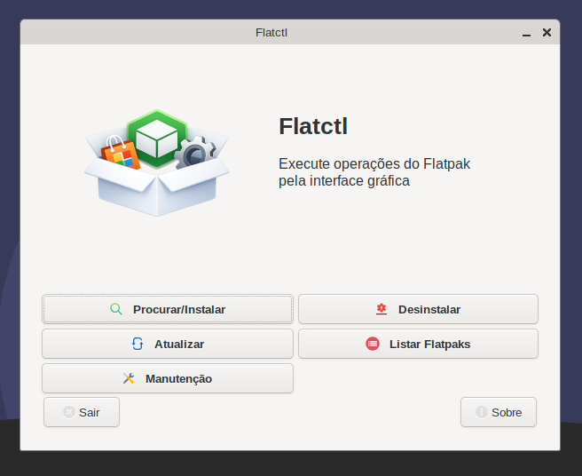
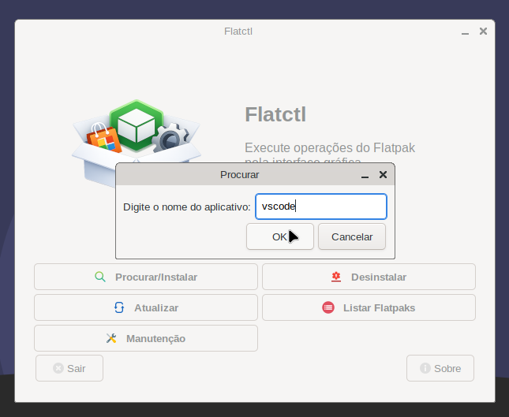
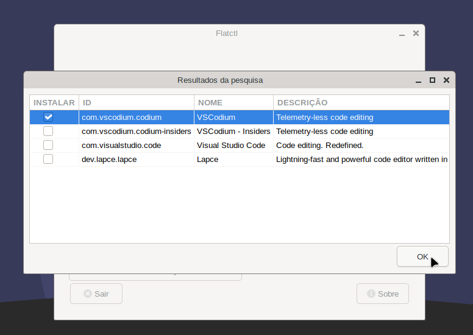
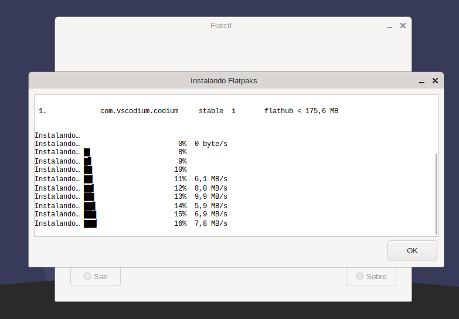

# Flatctl

🌍 Leia em outros idiomas:
- 🇺🇸 English: [README.md](README.md)

Flatctl é um gerenciador gráfico de Flatpaks escrito em Bash utilizando YAD.

Ele fornece uma interface simples para executar operações comuns do Flatpak sem precisar usar o terminal.

Eu desenvolvi ele principalmente porque uso Slackware e Salix Os como as minhas distros principais, e uso bastante Flatpaks, mas queria executar as operações usando uma interface gráfica.
Eu sei que existem soluções ***muito mais completas*** para esta tarefa, mas eu queria algo com interface gráfica e ao mesmo tempo simples e direto ao ponto.

---

## 📸 Screenshots

| Janela Principal | Diálogo de Pesquisa |
|-------------|--------------|
| [](screenshots/janela-rincipal.png) | [](screenshots/dialogo-pesquisa.png) |

| Resultados de Pesquisa | Processo de Instalação |
|----------------|----------------|
| [](screenshots/resultados-pesquisa.png) | [](screenshots/processo-instalacao.png) |

---

## ✨ Funcionalidades

- Procurar e instalar aplicações do Flathub (pode instalar em "lote" selecionando vários apps)
- Listar aplicativos e runtimes instalados
- Atualizar Flatpaks instalados
- Desinstalar aplicativos (pode desinstalar em "lote" selecionando vários apps)
- Executar manutenção básica:
  - `flatpak repair`
  - remoção de runtimes e dados não utilizados
- Saída em tempo real para operações longas
- Leve e minimalista
- Suporte a Português e Inglês

---

## 📦 Dependências

O Flatctl não realiza verificação automática de dependências durante a instalação.

Certifique-se de que os seguintes componentes estão instalados no sistema:

- Bash (versão moderna)
- Flatpak
- YAD (Yet Another Dialog)
- pkexec (polkit) - usado para a operação `flatpak repair`
- Repositório do Flathub adicionado e configurado no sistema

---

## 🧪 Testado com

- Bash 5.1.16
- Flatpak 1.14.10
- YAD 13.0

---

## 🧠 Design

O Flatctl não é apenas um wrapper simples para comandos do Flatpak.

Ele foi projetado para se comportar como uma aplicação real, mesmo sendo escrito inteiramente em Bash.

### Principais pontos de design

- **Controle de instância única**  
  Evita múltiplas execuções utilizando `flock`.

- **Controle de concorrência**  
  Garante que apenas uma operação seja executada por vez.

- **Isolamento de processos**  
  Utiliza `setsid` para gerenciar tarefas em segundo plano.

- **Comunicação entre processos**  
  Usa FIFOs para transmitir a saída dos comandos em tempo real.

- **Interface responsiva**  
  Operações longas exibem saída em tempo real usando YAD.

Essa abordagem evita o comportamento típico de "cadeia de diálogos" comum em scripts simples e proporciona uma experiência mais consistente.

---

## ⚙️ Premissas de design

O Flatctl é simples e direto ao ponto, por isso assume os seguintes pontos:

### Instalação system-wide do Flatpak

Todas as operações utilizam:
`--system`

Isso segue o modelo padrão do Flatpak, com autenticação via polkit.

---

### Uso do Flathub como repositório padrão

As aplicações são instaladas a partir do Flathub:
`flatpak install flathub <app>`

O Flatctl não suporta seleção de repositórios alternativos.

---

### Sem preocupação com portabilidade

O Flatctl utiliza recursos modernos do Bash e não tem como objetivo ser compatível com POSIX.

---

## 🚀 Instalação

Clone o repositório:

```bash
git clone https://github.com/yourusername/flatctl.git
cd flatctl
```

Execute o instalador:

```bash
$ ./install-flatctl
```

🗑️ Desinstalação:

Tal como a aplicação principal, o desinstalador é adicionado ao `$PATH`, desse modo basta executar no terminal:
```bash
$ uninstall-flatctl
```
E tudo o que for relacionado ao programa será removido.

🖥️ Uso

Execute:
```bash
$ flatctl
```

Ou utilize a entrada no menu de aplicações.

---

## 🌍 Idioma

O Flatctl detecta automaticamente o idioma do sistema através da variável:
`$LANG`

Idiomas suportados:

- Português
- Inglês

---

## ⚠️ Observações

- O Flatctl não tem como objetivo substituir interfaces completas para Flatpak.
- O foco é nas operações mais comuns do dia a dia.
- Funcionalidades avançadas estão fora do escopo.

---

## 👤 Autor

Pedro Fernandes

